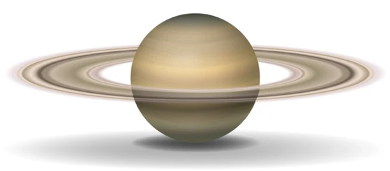

# ASCII Art Converter

This project converts images and videos into ASCII art. It can transform a single image to an ASCII string representation (saved as an image) and convert video files into ASCII art videos.

## Features

- Convert an image to an ASCII art image.
- Convert a video to an ASCII art video.
- Supports various image and video formats.

## Demo
#### Video to Video
<p align="center">
  
  
</p>

#### Image to Image
<p align="center">
  
  
</p>
## Installation

1. Clone the repository:
   ```bash
   git clone https://github.com/RobertArustamyan/AsciiArtConverter.git
    ```
2. Install dependencies:
   ```bash
   pip install -r requirements.txt
   ```
3. Create .env file and configurate the path to your project
   
## Usage
1. Image to Ascii
   ```bash
   python main.py path/to/input-image.png new_width -s/--string
   ```
2. Image to Image
   ```bash
   python main.py path/to/input-image.png new_width -i/--image
   ```
3. Video to Video

   ```bash
   python main.py path/to/video.mp4 new_width -v/--video
   ```
